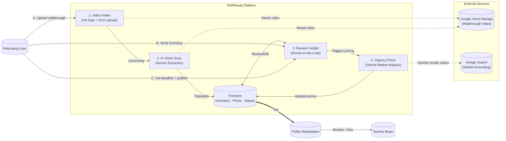

# ShiftReady Backend

[](https://www.python.org/downloads/)
[](https://fastapi.tiangolo.com/)
[](https://deepmind.google/technologies/gemini/)
[](https://cloud.google.com/run)
[](#license)

AI-native FastAPI service that automates residential relocation inventory management. Processes walkthrough videos with Gemini vision, extracts and prices household items, and publishes them to a marketplace — all before move-out day.

**Companion UI:** [`../shiftready-ui`](../shiftready-ui) — Next.js 16 / React 19 frontend.

---

## Table of Contents

- [Architecture](#architecture)
- [Tech Stack](#tech-stack)
- [Local Setup](#local-setup)
- [API Reference](#api-reference)
- [Sale Lifecycle](#sale-lifecycle)
- [Testing](#testing)
- [CI/CD](#cicd)
- [License](#license)

---

## Architecture



### Pipeline

```
PENDING_UPLOAD → PROCESSING → READY_FOR_REVIEW → PRICING_IN_PROGRESS → LIVE → ARCHIVED
```

### Project Layout

```
shiftready-backend/
├── app/
│   ├── main.py             # Entry point, middleware registration
│   ├── routers/
│   │   ├── sales.py        # Inventory & sales endpoints
│   │   └── marketplace.py  # Public marketplace endpoints
│   ├── models/
│   │   ├── inventory.py    # Domain models
│   │   └── schemas.py      # Request/response Pydantic schemas
│   ├── services/
│   │   ├── firestore.py    # All Firestore CRUD
│   │   ├── gemini.py       # Gemini vision + pricing calls
│   │   ├── pipelines.py    # Background AI pipeline tasks
│   │   ├── auth.py         # Firebase token validation
│   │   └── notifier.py     # WebSocket connection manager
│   └── utils/
│       └── gcs.py          # Signed URL generation
└── tests/
    ├── test_api.py
    ├── test_pipelines.py
    ├── test_sales.py
    └── integration/        # Full lifecycle, auth, marketplace, WebSocket
```

---

## Tech Stack

| Layer | Technology |
|---|---|
| Framework | FastAPI + Uvicorn (async Python 3.13) |
| AI | Google Gemini via `google-genai` SDK |
| AI Orchestration | LangChain + LangSmith |
| Database | Google Cloud Firestore (Native mode) |
| Storage | Google Cloud Storage |
| Auth | Firebase Admin SDK (ID token validation) |
| Real-time | WebSockets (FastAPI native) |
| Deployment | Google Cloud Run (`australia-southeast1`) |
| CI/CD | Google Cloud Build |

---

## Local Setup

### Prerequisites

- Python 3.13+
- Google Cloud CLI (`gcloud`) authenticated
- A GCP project with Firestore (Native mode), GCS, and Vertex AI enabled
- A Firebase project with Authentication enabled

### 1. Clone and install

```bash
git clone https://github.com/ajayaradhya/shiftready-backend.git
cd shiftready-backend

python -m venv .venv
source .venv/bin/activate      # macOS/Linux
# .venv\Scripts\activate       # Windows

pip install -r requirements.txt
```

### 2. Configure environment

```bash
cp .env.example .env
```

Edit `.env`:

```env
GCP_PROJECT_ID=your-project-id
GCP_SERVICE_ACCOUNT=your-service-account@your-project.iam.gserviceaccount.com
GCP_UPLOAD_BUCKET=your-gcs-bucket-name
GCP_REGION=australia-southeast1
GOOGLE_APPLICATION_CREDENTIALS=./shiftready-backend-service-account.json
```

Place your GCP service account key at `shiftready-backend-service-account.json` in the project root. This file is gitignored — never commit it.

### 3. Run

```bash
uvicorn app.main:app --reload --port 8080
```

| Endpoint | URL |
|---|---|
| Swagger UI | http://localhost:8080/docs |
| ReDoc | http://localhost:8080/redoc |
| Health check | http://localhost:8080/health |

### Local authentication

Any token prefixed with `dev_` bypasses Firebase verification when `K_SERVICE` is not set (i.e., outside Cloud Run). Use `dev_<your-name>` as a Bearer token in Swagger or curl.

**Swagger:** Click **Authorize** → enter `dev_yourname` → Authorize.

**curl:**
```bash
curl -X POST "http://localhost:8080/api/v1/sales/init" \
  -H "Authorization: Bearer dev_yourname" \
  -H "Content-Type: application/json" \
  -d '{"filename": "walkthrough.mp4"}'
```

---

## API Reference

All endpoints are prefixed with `/api/v1`. Protected endpoints require `Authorization: Bearer <token>`.

### Sales & Inventory (`/sales`)

| Method | Path | Description |
|---|---|---|
| `GET` | `/sales` | List all sales for the authenticated user |
| `POST` | `/sales/init` | Initialize a sale; returns a GCS signed PUT URL |
| `POST` | `/sales/{id}/process` | Trigger Gemini vision extraction |
| `GET` | `/sales/{id}/status` | Poll current sale status |
| `GET` | `/sales/{id}/summary` | Full inventory hierarchy with signed video URL |
| `WS` | `/sales/{id}/ws` | WebSocket stream for real-time status updates |
| `POST` | `/sales/{id}/estimate` | Trigger Gemini pricing analysis |
| `POST` | `/sales/{id}/publish` | Publish sale to the marketplace |
| `POST` | `/sales/{id}/unpublish` | Unpublish an active sale |
| `POST` | `/sales/{id}/bundles` | Add a bundle to the sale |
| `DELETE` | `/sales/{id}/bundles/{bundle_id}` | Remove a bundle |
| `POST` | `/sales/{id}/bundles/{bundle_id}/items` | Add a manual item to a bundle |
| `PATCH` | `/sales/{id}/bundles/{bundle_id}/items/{item_id}` | Update an item |
| `DELETE` | `/sales/{id}/bundles/{bundle_id}/items/{item_id}` | Remove an item |

### Marketplace (`/marketplace`)

| Method | Path | Description |
|---|---|---|
| `GET` | `/marketplace/search` | Search live sales (supports suburb + keyword filters) |
| `GET` | `/marketplace/items/{event_id}/{bundle_id}/{item_id}` | Item detail (seller info masked for non-owners) |

---

## Sale Lifecycle

| Status | Description |
|---|---|
| `PENDING_UPLOAD` | Sale record created; waiting for GCS video upload |
| `PROCESSING` | Gemini Vision extracting items and bundles from video |
| `READY_FOR_REVIEW` | Inventory ready; user can edit before pricing |
| `PRICING_IN_PROGRESS` | Gemini analysing Sydney market for price estimates |
| `LIVE` | Sale published and publicly visible on marketplace |
| `ARCHIVED` | Move complete; record frozen |

Terminal states: `PARTIALLY_SOLD`, `EXPIRED`, `FAILED`, `ARCHIVED`.

---

## Future TODOs

1. Guided live capture, not dump-and-pray
Problem: mover shoots 8-min shaky walkthrough. Misses items in cupboards, brand labels never in frame, blur kills frames. Re-shoot = abandon.

Fix: in-app camera w/ realtime co-pilot (Gemini Live API or on-device MediaPipe + streaming chunks to backend).

Detects room change → "Kitchen detected, pan slowly left."
Spots furniture w/o visible label → "Tap sofa to mark, then closeup of tag underneath."
Progress bar: rooms covered, items found, missing-data flags.
Uploads chunks during capture → extraction starts before user hits stop. Perceived latency drops from minutes to seconds.
Implementation: stream video/webm chunks to GCS, fire extraction per-chunk, merge bundles. Reuse existing pipeline, swap single-shot for incremental.

2. Two-pass extraction w/ targeted re-prompt
Problem: one Gemini call guesses brand/year/price from blurry mid-pan frame. Hallucinates "Samsung" on every TV. predicted_original_price often wildly off.

Fix: confidence-aware loop.

Pass 1 (current): wide identify → bundles + items + per-field confidence (add to schema).
Pass 2: backend extracts high-res frame crops at video_timestamp for each low-confidence item, re-queries Gemini w/ crop + grounded web search ("find this exact model") → fills brand/model/year w/ citations stored in pricing_reasoning-style field.
Pass 3 (user-facing): items still unresolved become a short "1-tap task list" — "Snap photo of TV back panel for model number". Mover does 4 closeups instead of editing 40 forms.
LLM win: smaller targeted prompts > one mega-prompt. Cheaper, more accurate, auditable.

3. Conversational item refinement, kill the form
Problem: review cockpit = 40 cards × 8 fields each. Tedious. Movers bail.

Fix: chat-per-item w/ multimodal context.

Card opens chat: "IKEA Malm, bought 2019, small scratch on top" → LLM patches structured fields + recomputes price + updates condition.
Voice input ("ok Google" style) — mover talks while packing.
Cross-item ops: "Everything in kitchen is 5 years old" → bulk update.
"Did you miss anything?" — mover types "there's a dyson vacuum in hall closet" → item created w/o video reshoot.
Frame scrubber w/ tap-to-add: "that thing top-left at 2:34" → Gemini re-extracts that crop only.
Backend: new PATCH /items/{id}/refine taking message + optional image, returns diff + new pricing. Reuses pricing service.

---

## Testing

```bash
# Full suite with coverage
pytest --cov=app --cov-report=term-missing

# Single file
pytest tests/test_sales.py -v

# Single test
pytest tests/test_sales.py::test_function_name -v

# Integration tests only
pytest tests/integration/ -v
```

Tests cover: sale lifecycle, authorization, inventory CRUD, marketplace, pipelines, and WebSocket.

---

## CI/CD

`cloudbuild.yaml` runs on every push:

1. **Lint** — `ruff check` (excludes `scripts/`)
2. **Test** — `pytest` with coverage; report uploaded as XML artifact
3. **Build** — Docker image built with layer caching from the previous `latest` tag
4. **Push** — Tagged `SHORT_SHA` and `latest` to Google Artifact Registry
5. **Deploy** — Cloud Run deployment to `australia-southeast1`, unauthenticated access

Machine: `E2_HIGHCPU_8` | Timeout: 1200s

---

## Working with the Full Stack

Both repos are designed to be edited together in a single Claude Code session:

```bash
# From the backend directory
claude --add-dir ../shiftready-ui
```

See [`../shiftready-ui`](../shiftready-ui) for the frontend README.

---

## License

Internal proprietary — ShiftReady 2026.
