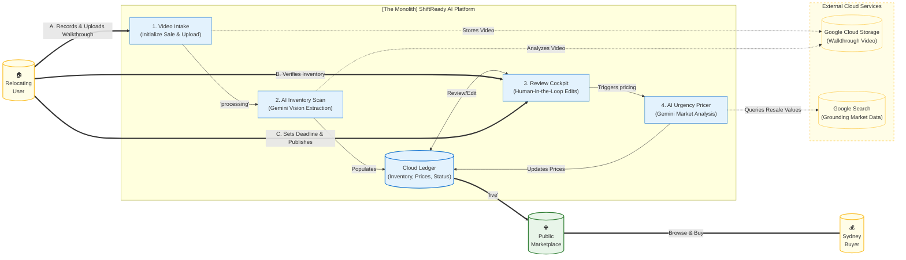

# ShiftReady Backend | The Relocation Monolith

[](https://www.python.org/downloads/)
[](https://fastapi.tiangolo.com/)
[](https://deepmind.google/technologies/gemini/)
[](#architecture)

ShiftReady is an AI-enabled relocation and inventory management monolith designed to streamline residential transitions. It orchestrates a multi-stage pipeline from computer vision-based inventory extraction to market-aware pricing enabling users to bundle and sell household assets before their move-out deadline.

---

## Key Features

- **Temporal Vision Extraction**: Processes residential walkthrough videos using Gemini 3.1 Flash Lite with clock-time anchoring to identify assets and room bundles.
- **Urgency-Aware Pricing Engine**: Real-time Sydney market analysis (Waterloo/Zetland/Alexandria) that adjusts listing prices based on move-out deadlines.
- **State Machine Architecture**: A robust transition engine (Firestore-backed) managing sale lifecycles from `PENDING_UPLOAD` to `LIVE` and `ARCHIVED`.
- **Zero-Blink Polling**: Optimized polling endpoints for seamless UI transitions during intensive AI workloads.
- **Marketplace Sync**: Automated bundle-total recalculations and inventory synchronization across the cloud ledger.

---

## Tech Stack

- **Framework**: FastAPI (Asynchronous Python 3.11+)
- **Intelligence**: Gemini 3.1 Flash Lite (via Google GenAI Vertex AI SDK)
- **Database**: Google Cloud Firestore (NoSQL Hierarchical Storage)
- **Storage**: Google Cloud Storage (GCS)
- **Deployment**: Google Cloud Run (Containerized Monolith)

---

## Architecture: The Intelligent Monolith

The project follows a modular monolith pattern, isolating business logic (Services) from the interface (Routers) to ensure maintainability.



## File Structure

```text
app/
├── models/         # Pydantic Schemas & Data Models
├── routers/        # FastAPI Route Handlers (Sales, Inventory, etc.)
├── services/       # Core Logic (Firestore, Gemini, GCS Utils)
├── utils/          # Shared Helpers (GCS Signers, Formatting)
└── main.py         # Entry point & Global Middleware
```

## 🔧 Local Setup

### 1. Prerequisites

- Python 3.11+
- Google Cloud CLI (`gcloud`) configured
- Firestore instance enabled in Native Mode

---

### 2. Installation

```bash
git clone https://github.com/ajayaradhya/shiftready-backend.git
cd shiftready-backend

# Create and activate virtual environment
python -m venv .venv
source .venv/bin/activate  # MacOS/Linux
# .venv\Scripts\activate   # Windows

# Install dependencies
pip install -r requirements.txt
```

### 3. Environment Variables (.env)

1. **Service Account**: Obtain the JSON key from the GCP Console (IAM > Service Accounts > Keys) and save it as `shiftready-backend-service-account.json` in the root.
2. **Security**: Ensure this file is listed in your `.gitignore` to prevent accidental commits.
3. **.env Setup**: Copy `.env.example` contents into `.env` file. Ask a developer for the contents. It should look like this:

```env
GCP_PROJECT_ID=your-project-id
GCP_UPLOAD_BUCKET=your-gcs-bucket-name
GOOGLE_APPLICATION_CREDENTIALS=shiftready-backend-service-account.json
PORT=8080
```

### 4. Running the Project
Development Mode
```bash
uvicorn app.main:app --reload --port 8080
```

API Documentation

```text
Swagger UI: http://localhost:8080/docs

ReDoc: http://localhost:8080/redoc
```

Stopping the process
```bash
stop-process -id (get-nettcpconnection -localport 8080).owningprocess -force
```

## Sale Lifecycle (State Machine)

| Status                | Description                                               |
| --------------------- | --------------------------------------------------------- |
| `PENDING_UPLOAD`      | Sale initialized; waiting for GCS video upload.           |
| `PROCESSING`          | Gemini Vision is extracting items and bundles from video. |
| `READY_FOR_REVIEW`    | Inventory prepared for user verification.                 |
| `PRICING_IN_PROGRESS` | Gemini is analyzing market trends for valuation.          |
| `LIVE`                | Sale is public on the marketplace.                        |
| `ARCHIVED`            | Move complete; record frozen for history.                 |

## Authentication (Local Development)

The backend supports mock authentication for local development and testing. Any token starting with `dev_` will be accepted.

### Swagger UI
1. Open `http://localhost:8080/docs`.
2. Click the **Authorize** button (lock icon).
3. In the Value field, enter: `dev_ajay_2026`.
4. Click **Authorize** and then **Close**.

### JavaScript / Fetch
```javascript
const response = await fetch('/api/v1/sales/init', {
  method: 'POST',
  headers: {
    'Authorization': 'Bearer dev_ajay_2026',
    'Content-Type': 'application/json'
  },
  body: JSON.stringify({ filename: 'walkthrough.mp4' })
});
```

## Testing the Pipelines

### Initialise a Sale

```curl
curl -X POST "http://localhost:8080/api/v1/sales/init" \
  -H "Authorization: Bearer dev_ajay_2026" \
  -H "Content-Type: application/json" \
  -d '{"filename": "walkthrough.mp4"}'
```
### Trigger Pricing Analysis

```bash
curl -X POST "http://localhost:8000/api/v1/sales/{event_id}/estimate"
```

### License
Internal Proprietary - ShiftReady 2026
