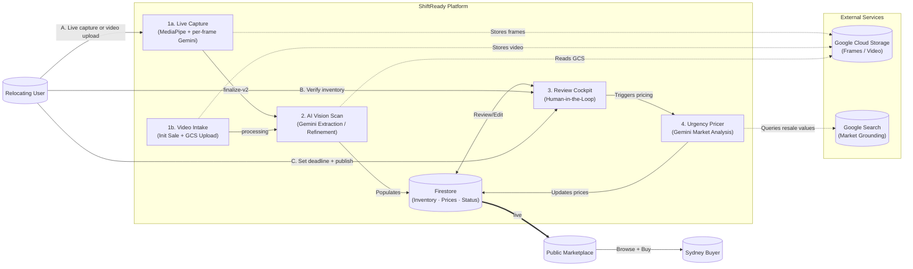

# ShiftReady Backend

[](https://www.python.org/downloads/)
[](https://fastapi.tiangolo.com/)
[](https://deepmind.google/technologies/gemini/)
[](https://cloud.google.com/run)
[](#license)

AI-native FastAPI service that automates residential relocation inventory management. Supports guided live capture (MediaPipe + per-frame Gemini) and walkthrough video upload. Extracts, prices, and publishes household items to a marketplace — all before move-out day.

**Companion UI:** [`../shiftready-ui`](../shiftready-ui) — Next.js 16 / React 19 frontend.

---

## Table of Contents

- [Architecture](#architecture)
- [Tech Stack](#tech-stack)
- [Local Setup](#local-setup)
- [API Reference](#api-reference)
- [Sale Lifecycle](#sale-lifecycle)
- [Testing](#testing)
- [CI/CD](#cicd)
- [License](#license)

---

## Architecture



### Pipeline (state machine)

```
PENDING_UPLOAD → PROCESSING → READY_FOR_REVIEW → PRICING_IN_PROGRESS → LIVE → ARCHIVED
```

Terminal states: `PARTIALLY_SOLD`, `EXPIRED`, `FAILED`, `ARCHIVED`.

### Project Layout

```
shiftready-backend/
├── app/
│   ├── main.py             # Entry point, CORS, middleware registration
│   ├── routers/
│   │   ├── sales.py        # Inventory, capture, and sales endpoints
│   │   └── marketplace.py  # Public marketplace endpoints (no auth)
│   ├── ai/
│   │   ├── extraction.py   # ExtractionService: walkthrough, frames, single-frame, refinement
│   │   ├── pricing.py      # PricingService: urgency-aware Sydney market pricing
│   │   ├── schemas.py      # AI output schemas (SingleFrameResult, PricingList, RefinementResult)
│   │   ├── schema_utils.py # Gemini-compatible JSON schema conversion
│   │   └── client.py       # Gemini client factory
│   ├── models/
│   │   ├── inventory.py    # Domain models (RoomBundle, InventoryItem)
│   │   └── schemas.py      # Request/response Pydantic schemas
│   ├── repos/
│   │   ├── sale_repo.py    # Sale CRUD
│   │   ├── bundle_repo.py  # Bundle CRUD
│   │   ├── item_repo.py    # Item CRUD
│   │   ├── marketplace_repo.py
│   │   └── user_repo.py
│   ├── services/
│   │   ├── firestore.py    # Firestore facade (delegates to repos/)
│   │   ├── gemini.py       # GeminiProcessor facade
│   │   ├── pipelines.py    # Background AI tasks (extraction, refinement, pricing)
│   │   ├── auth.py         # Firebase token validation
│   │   ├── notifier.py     # WebSocket ConnectionManager
│   │   └── jobs.py         # Cloud Run Job triggers (frame extractor)
│   ├── core/
│   │   ├── config.py       # Settings (pydantic-settings)
│   │   ├── deps.py         # FastAPI dependency injectors
│   │   ├── logging.py      # Structured logging
│   │   └── middleware.py   # Request middleware
│   └── domain/
│       └── status.py       # SaleStatus enum
├── jobs/
│   └── frame_extractor/    # Cloud Run Job: extract still frames from video at timestamps
└── tests/
    ├── test_api.py
    ├── test_pipelines.py
    ├── test_sales.py
    └── integration/        # Full lifecycle, auth, marketplace, WebSocket
```

---

## Tech Stack

| Layer | Technology |
|---|---|
| Framework | FastAPI + Uvicorn (async Python 3.13) |
| AI | Google Gemini 2.5 Flash via `google-genai` SDK |
| Database | Google Cloud Firestore (Native mode) |
| Storage | Google Cloud Storage |
| Auth | Firebase Admin SDK (ID token validation) |
| Real-time | WebSockets (FastAPI native) |
| Deployment | Google Cloud Run (`australia-southeast1`) |
| CI/CD | Google Cloud Build |

---

## Local Setup

### Prerequisites

- Python 3.13+
- Google Cloud CLI (`gcloud`) authenticated
- GCP project with Firestore (Native mode), GCS, and Vertex AI enabled
- Firebase project with Authentication enabled

### 1. Clone and install

```bash
git clone https://github.com/ajayaradhya/shiftready-backend.git
cd shiftready-backend

python -m venv .venv
source .venv/bin/activate      # macOS/Linux
# .venv\Scripts\activate       # Windows

pip install -r requirements.txt
```

### 2. Configure environment

```bash
cp .env.example .env
```

Edit `.env`:

```env
GCP_PROJECT_ID=your-project-id
GCP_SERVICE_ACCOUNT=your-service-account@your-project.iam.gserviceaccount.com
GCP_UPLOAD_BUCKET=your-gcs-bucket-name
GCP_REGION=australia-southeast1
GOOGLE_APPLICATION_CREDENTIALS=./shiftready-backend-service-account.json
```

Place your GCP service account key at `shiftready-backend-service-account.json`. This file is gitignored — never commit it.

### 3. Run

```bash
uvicorn app.main:app --reload --port 8080
```

| Endpoint | URL |
|---|---|
| Swagger UI | http://localhost:8080/docs |
| ReDoc | http://localhost:8080/redoc |
| Health check | http://localhost:8080/health |

### Local authentication

Tokens prefixed with `dev_` bypass Firebase verification when `K_SERVICE` is absent (outside Cloud Run).

**Swagger:** Click **Authorize** → enter `dev_yourname`.

**curl:**
```bash
curl -X POST "http://localhost:8080/api/v1/sales/init-capture" \
  -H "Authorization: Bearer dev_yourname"
```

---

## API Reference

All endpoints prefixed `/api/v1`. Protected endpoints require `Authorization: Bearer <token>`.

### Sales & Inventory (`/sales`)

| Method | Path | Auth | Description |
|---|---|---|---|
| `GET` | `/sales` | Required | List all sales for the authenticated user |
| `POST` | `/sales/init` | Required | Initialize video-upload sale; returns GCS signed PUT URL |
| `POST` | `/sales/init-capture` | Required | Initialize live-capture sale (no video needed) |
| `POST` | `/sales/{id}/process` | Owner | Trigger Gemini extraction from uploaded video |
| `POST` | `/sales/{id}/process-frames` | Owner | Upload JPEG frames + run batch Gemini extraction |
| `POST` | `/sales/{id}/capture/frame` | Owner | Per-frame live capture: upload JPEG, run Gemini single-frame identify, return name/brand/price/gcs_uri |
| `POST` | `/sales/{id}/capture/finalize` | Owner | Finalize capture (legacy): trigger batch extraction on accumulated GCS URIs |
| `POST` | `/sales/{id}/capture/finalize-v2` | Owner | Finalize capture (Phase 2): accept pre-analyzed items, run refinement + pricing pipeline |
| `POST` | `/sales/{id}/append-init` | Owner | Generate signed URL to append a second video to existing sale |
| `POST` | `/sales/{id}/append-process` | Owner | Trigger append extraction (adds bundles without clearing existing) |
| `GET` | `/sales/{id}/status` | Owner | Poll current sale status |
| `GET` | `/sales/{id}/summary` | Owner | Full inventory hierarchy with signed URLs for video and item images |
| `WS` | `/sales/{id}/ws` | Owner | WebSocket stream for real-time status updates |
| `POST` | `/sales/{id}/estimate` | Owner | Trigger Gemini pricing analysis |
| `POST` | `/sales/{id}/publish` | Owner | Publish sale to the marketplace |
| `POST` | `/sales/{id}/unpublish` | Owner | Unpublish an active sale |
| `POST` | `/sales/{id}/bundles` | Owner | Add a bundle |
| `DELETE` | `/sales/{id}/bundles/{bundle_id}` | Owner | Remove a bundle |
| `POST` | `/sales/{id}/bundles/{bundle_id}/items` | Owner | Add a manual item |
| `PATCH` | `/sales/{id}/bundles/{bundle_id}/items/{item_id}` | Owner | Update an item |
| `DELETE` | `/sales/{id}/bundles/{bundle_id}/items/{item_id}` | Owner | Remove an item |
| `POST` | `/sales/{id}/bundles/{bundle_id}/items/{item_id}/images/upload-urls` | Owner | Get signed PUT URLs for item images |
| `POST` | `/sales/{id}/bundles/{bundle_id}/items/{item_id}/images/confirm` | Owner | Confirm uploaded images (write to Firestore) |
| `DELETE` | `/sales/{id}/bundles/{bundle_id}/items/{item_id}/images/{image_id}` | Owner | Delete an item image |
| `PATCH` | `/sales/{id}/bundles/{bundle_id}/items/{item_id}/images/{image_id}/cover` | Owner | Set cover image |

### Marketplace (`/marketplace`) — no auth required for browsing

| Method | Path | Description |
|---|---|---|
| `GET` | `/marketplace/sales` | List all LIVE sales |
| `GET` | `/marketplace/search` | Search with `?q=keyword&suburb=suburb` |
| `GET` | `/marketplace/sales/{event_id}` | Public sale detail (bundles + items) |
| `GET` | `/marketplace/items/{event_id}/{bundle_id}/{item_id}` | Item detail (seller info masked for non-owners) |

---

## Sale Lifecycle

| Status | Description |
|---|---|
| `PENDING_UPLOAD` | Sale record created; awaiting video upload or capture start |
| `PROCESSING` | Gemini extracting or refining items |
| `READY_FOR_REVIEW` | Inventory ready; seller can edit before pricing |
| `PRICING_IN_PROGRESS` | Gemini analysing Sydney market for price estimates |
| `LIVE` | Published and publicly visible on marketplace |
| `PARTIALLY_SOLD` | Some items sold; still active |
| `ARCHIVED` | Move complete; record frozen |
| `FAILED` | Pipeline error; recoverable by re-triggering |
| `EXPIRED` | Passed move-out date without publishing |

---

## Testing

```bash
# Full suite with coverage
pytest --cov=app --cov-report=term-missing

# Single file
pytest tests/test_sales.py -v

# Single test
pytest tests/test_sales.py::test_function_name -v

# Integration tests only
pytest tests/integration/ -v
```

Tests cover: sale lifecycle, authorization, inventory CRUD, marketplace, pipelines, and WebSocket.

---

## CI/CD

`cloudbuild.yaml` runs on every push to `master`:

1. **Lint** — `ruff check` (excludes `scripts/`)
2. **Build** — Docker image with layer caching from previous `latest`
3. **Push** — Tagged `SHORT_SHA` and `latest` to Google Artifact Registry
4. **Firestore indexes** — deploy index configuration
5. **Deploy backend** — Cloud Run (`australia-southeast1`), unauthenticated
6. **Build + deploy frame-extractor** — separate Cloud Run Job for video frame extraction

Machine: `E2_HIGHCPU_8` | Timeout: 1200s

---

## Working with the Full Stack

```bash
# From the backend directory
claude --add-dir ../shiftready-ui
```

See [`../shiftready-ui`](../shiftready-ui) for the frontend README.

---

## License

Internal proprietary — ShiftReady 2026.
