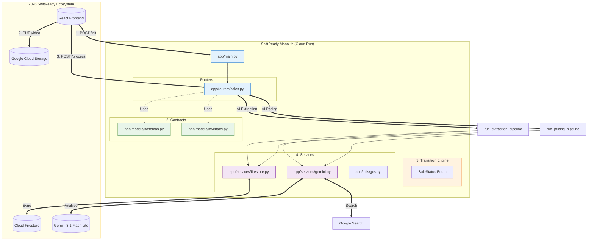

# ShiftReady Backend | The Relocation Monolith

[](https://www.python.org/downloads/)
[](https://fastapi.tiangolo.com/)
[](https://deepmind.google/technologies/gemini/)
[](#architecture)

ShiftReady is an AI-enabled relocation and inventory management monolith designed to streamline residential transitions. It orchestrates a multi-stage pipeline from computer vision-based inventory extraction to market-aware pricing enabling users to bundle and sell household assets before their move-out deadline.

---

## Key Features

- **Temporal Vision Extraction**: Processes residential walkthrough videos using Gemini 3.1 Flash Lite with clock-time anchoring to identify assets and room bundles.
- **Urgency-Aware Pricing Engine**: Real-time Sydney market analysis (Waterloo/Zetland/Alexandria) that adjusts listing prices based on move-out deadlines.
- **State Machine Architecture**: A robust transition engine (Firestore-backed) managing sale lifecycles from `PENDING_UPLOAD` to `LIVE` and `ARCHIVED`.
- **Zero-Blink Polling**: Optimized polling endpoints for seamless UI transitions during intensive AI workloads.
- **Marketplace Sync**: Automated bundle-total recalculations and inventory synchronization across the cloud ledger.

---

## Tech Stack

- **Framework**: FastAPI (Asynchronous Python 3.11+)
- **Intelligence**: Gemini 3.1 Flash Lite (via Google GenAI Vertex AI SDK)
- **Database**: Google Cloud Firestore (NoSQL Hierarchical Storage)
- **Storage**: Google Cloud Storage (GCS)
- **Deployment**: Google Cloud Run (Containerized Monolith)

---

## Architecture: The Intelligent Monolith

The project follows a modular monolith pattern, isolating business logic (Services) from the interface (Routers) to ensure maintainability.



## File Structure

```text
app/
├── models/         # Pydantic Schemas & Data Models
├── routers/        # FastAPI Route Handlers (Sales, Inventory, etc.)
├── services/       # Core Logic (Firestore, Gemini, GCS Utils)
├── utils/          # Shared Helpers (GCS Signers, Formatting)
└── main.py         # Entry point & Global Middleware
```

## 🔧 Local Setup

### 1. Prerequisites

- Python 3.11+
- Google Cloud CLI (`gcloud`) configured
- Firestore instance enabled in Native Mode

---

### 2. Clone & Environment

```bash
git clone <your-repo-url>
cd project-backend

python -m venv .venv
source .venv/bin/activate  # Windows: .venv\Scripts\activate

pip install -r requirements.txt
```

### 3. Environment Variables (.env)

Create a .env file in the root directory:

```env
GCP_PROJECT_ID=your-project-id
GCP_UPLOAD_BUCKET=your-gcs-bucket-name
GOOGLE_APPLICATION_CREDENTIALS=path/to/your/service-account.json
PORT=8000
```

### 4. Running the Project
Development Mode
```bash
uvicorn app.main:app --reload --port 8000
```

API Documentation

```text
Swagger UI: http://localhost:8000/docs

ReDoc: http://localhost:8000/redoc
```

## Sale Lifecycle (State Machine)

| Status                | Description                                               |
| --------------------- | --------------------------------------------------------- |
| `PENDING_UPLOAD`      | Sale initialized; waiting for GCS video upload.           |
| `PROCESSING`          | Gemini Vision is extracting items and bundles from video. |
| `READY_FOR_REVIEW`    | Inventory prepared for user verification.                 |
| `PRICING_IN_PROGRESS` | Gemini is analyzing market trends for valuation.          |
| `LIVE`                | Sale is public on the marketplace.                        |
| `ARCHIVED`            | Move complete; record frozen for history.                 |

## Testing the Pipelines

### Initialise a Sale

```curl
curl -X POST "http://localhost:8000/api/v1/sales/init" \
  -H "Content-Type: application/json" \
  -d '{"user_id": "test_user", "filename": "walkthrough.mp4"}'
```
### Trigger Pricing Analysis

```bash
curl -X POST "http://localhost:8000/api/v1/sales/{event_id}/estimate"
```

### License
Internal Proprietary - ShiftReady 2026
