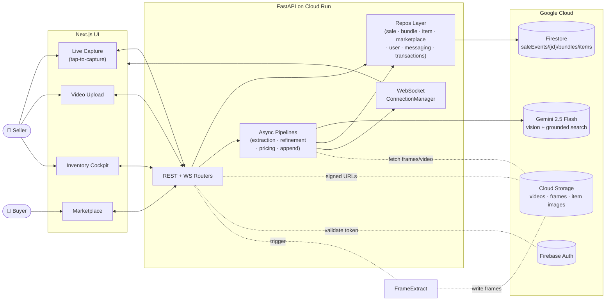
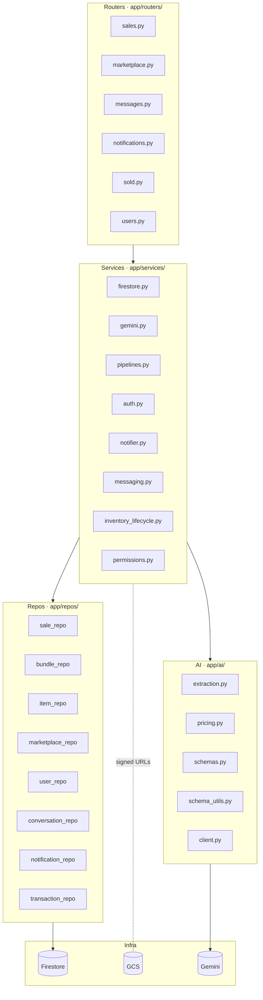
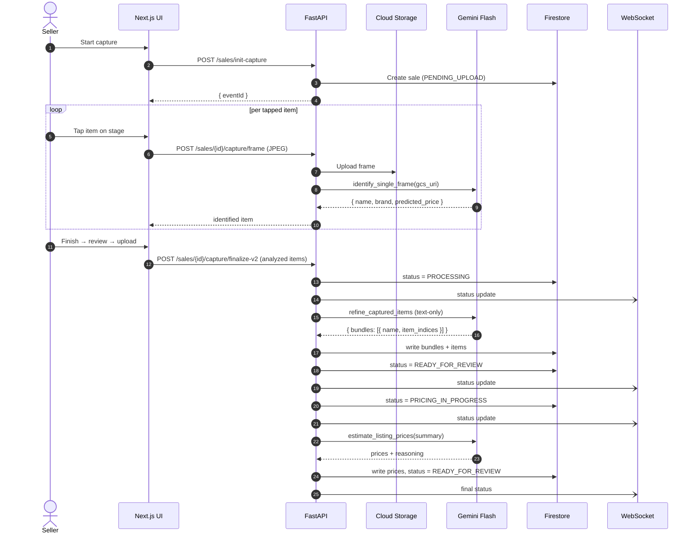
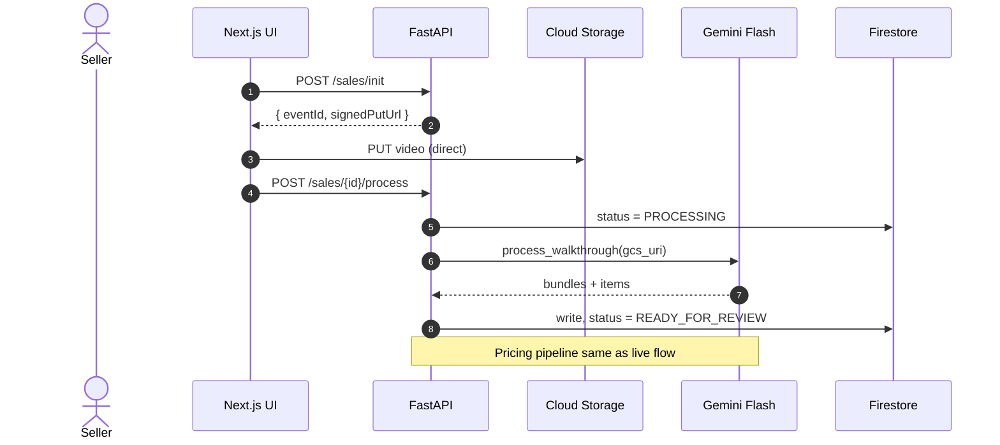
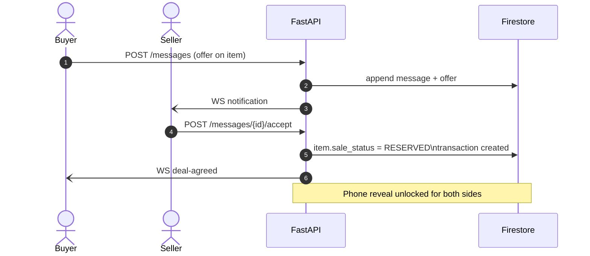
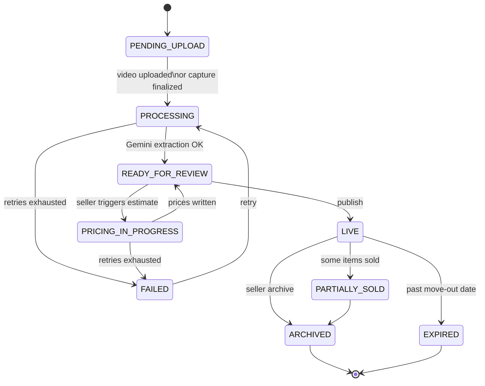
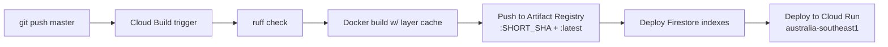

<div align="center">

# ShiftReady Backend

**AI-native FastAPI service for residential relocation inventory management.**

[](https://www.python.org/)
[](https://fastapi.tiangolo.com/)
[](https://deepmind.google/technologies/gemini/)
[](https://cloud.google.com/run)
[](https://firebase.google.com/docs/firestore)
[](#license)

Live capture or video upload → Gemini vision extraction → urgency-aware pricing → public marketplace.

[Companion UI](../shiftready-ui) · [API Docs](http://localhost:8080/docs) · [Report Issue](https://github.com/ajayaradhya/shiftready-backend/issues)

</div>

---

## Table of Contents

- [Overview](#overview)
- [Features](#features)
- [Architecture](#architecture)
- [Sequence Flows](#sequence-flows)
- [Sale Lifecycle](#sale-lifecycle)
- [Tech Stack](#tech-stack)
- [Getting Started](#getting-started)
- [Configuration](#configuration)
- [Project Layout](#project-layout)
- [API Reference](#api-reference)
- [Authentication](#authentication)
- [Real-Time Updates](#real-time-updates)
- [Testing](#testing)
- [Deployment](#deployment)
- [Observability](#observability)
- [Security](#security)
- [Contributing](#contributing)
- [License](#license)

---

## Overview

ShiftReady removes the friction of selling household belongings before a move. Sellers either walk through their home with a guided tap-to-capture flow or upload a single walkthrough video. The backend orchestrates Google Gemini to identify items, group them by room, estimate Sydney resale prices weighted by the seller's move-out deadline, and publish a buyer-facing marketplace listing.

This repository is the FastAPI service powering that pipeline. It exposes REST + WebSocket endpoints to the [`shiftready-ui`](../shiftready-ui) Next.js frontend and coordinates Firestore, Cloud Storage, Gemini, and a separate Cloud Run Job for frame extraction.

---

## Features

- **Dual capture modes** — guided live capture (per-frame Gemini identify) and walkthrough video upload (full extraction + refinement).
- **Structured AI output** — Pydantic schemas + Gemini `response_mime_type="application/json"` for deterministic, validated responses.
- **Urgency-weighted pricing** — Gemini market analysis discounted by days-until-move-out.
- **Buyer-seller messaging** — single thread per pair with per-message sale context, structured offers, post-deal phone reveal.
- **Real-time status** — WebSocket fan-out via `ConnectionManager`; clients receive pipeline state transitions live.
- **Background pipelines** — async tasks with exponential retry and `FAILED` fallback for extraction, refinement, pricing, and append flows.
- **Resource-level auth** — Firebase ID tokens with `validate_sale_owner` ownership checks; anonymous marketplace browsing with seller details masked.
- **Signed-URL only GCS access** — raw paths never leak to the client (15-min PUT, 1-hour GET).

---

## Architecture

### System view



### Layered architecture



---

## Sequence Flows

### Live capture (primary)



### Video upload



### Buyer offer → deal-agreed



---

## Sale Lifecycle



| Status | Meaning |
|---|---|
| `PENDING_UPLOAD` | Sale record created; awaiting video or capture |
| `PROCESSING` | Gemini extracting or refining |
| `READY_FOR_REVIEW` | Inventory ready; seller edits before pricing |
| `PRICING_IN_PROGRESS` | Gemini market analysis running |
| `LIVE` | Published and publicly visible |
| `PARTIALLY_SOLD` | Some items sold; sale still active |
| `ARCHIVED` | Frozen post-move |
| `FAILED` | Pipeline error; recoverable |
| `EXPIRED` | Move-out passed without publish |

---

## Tech Stack

| Layer | Technology |
|---|---|
| Language | Python 3.13 (modern type hints, `dict[str, Any]`) |
| Framework | FastAPI + Uvicorn (fully async) |
| AI | Google Gemini 2.5 Flash via `google-genai` SDK |
| Database | Google Cloud Firestore (Native mode) |
| Storage | Google Cloud Storage (signed URLs only) |
| Auth | Firebase Admin SDK |
| Real-time | Native FastAPI WebSockets |
| Validation | Pydantic v2 + `pydantic-settings` |
| Background jobs | `BackgroundTasks` (FastAPI async) |
| Tests | pytest + pytest-asyncio + pytest-cov |
| Lint | Ruff |
| Deployment | Cloud Run · Cloud Build · Artifact Registry (`australia-southeast1`) |

---

## Getting Started

### Prerequisites

- Python 3.13+
- `gcloud` CLI authenticated against your GCP project
- GCP project with: Firestore (Native), Cloud Storage, Vertex AI / Gemini API enabled
- Firebase project with Authentication enabled
- Service account key JSON

### Install

```bash
git clone https://github.com/ajayaradhya/shiftready-backend.git
cd shiftready-backend

python -m venv .venv
source .venv/bin/activate          # macOS/Linux
# .venv\Scripts\Activate.ps1       # Windows PowerShell

pip install -r requirements.txt
```

### Run

```bash
uvicorn app.main:app --reload --port 8080
```

| Endpoint | URL |
|---|---|
| Swagger UI | http://localhost:8080/docs |
| ReDoc | http://localhost:8080/redoc |
| Health | http://localhost:8080/health |

### Full-stack session

The frontend lives in a sibling repo. Launch Claude Code (or your editor of choice) with both directories editable:

```bash
claude --add-dir ../shiftready-ui
```

---

## Configuration

Copy the template and fill in:

```bash
cp .env.example .env
```

| Variable | Required | Description |
|---|---|---|
| `GCP_PROJECT_ID` | yes | GCP project for Firestore + GCS + Gemini |
| `GCP_SERVICE_ACCOUNT` | yes | Service account email used for signed URLs |
| `GCP_UPLOAD_BUCKET` | yes | GCS bucket name |
| `GCP_REGION` | yes | e.g. `australia-southeast1` |
| `GOOGLE_APPLICATION_CREDENTIALS` | yes (local) | Path to service account JSON |
| `K_SERVICE` | auto | Injected by Cloud Run; absence enables dev auth bypass |

Never commit the service account JSON. It is gitignored.

---

## Project Layout

```
shiftready-backend/
├── app/
│   ├── main.py                  # Entry point, CORS, middleware, router registration
│   ├── routers/
│   │   ├── sales.py             # Inventory, capture, sales endpoints
│   │   ├── marketplace.py       # Public marketplace (anonymous browse)
│   │   ├── messages.py          # Buyer-seller messaging + offers
│   │   ├── notifications.py     # In-app notification feed
│   │   ├── sold.py              # Mark sold (item/bundle/sale rollup)
│   │   └── users.py             # User profile + username
│   ├── services/
│   │   ├── firestore.py         # Firestore facade — composes repos/
│   │   ├── gemini.py            # GeminiProcessor facade
│   │   ├── pipelines.py         # Background AI pipelines
│   │   ├── auth.py              # Firebase token validation
│   │   ├── notifier.py          # WebSocket ConnectionManager
│   │   ├── messaging.py         # Conversation + offer logic
│   │   ├── inventory_lifecycle.py  # Sold-state machine
│   │   └── permissions.py       # Resource-level auth helpers
│   ├── ai/
│   │   ├── extraction.py        # ExtractionService (walkthrough, frames, single-frame, refinement)
│   │   ├── pricing.py           # PricingService (urgency-weighted)
│   │   ├── schemas.py           # AI output schemas
│   │   ├── schema_utils.py      # Gemini-compatible JSON schema conversion
│   │   └── client.py            # Gemini client factory
│   ├── repos/                   # Direct Firestore document access (one repo per collection)
│   ├── models/                  # Domain + request/response Pydantic schemas
│   ├── core/                    # config · deps · logging · middleware
│   ├── domain/                  # Enums (SaleStatus, etc.)
│   └── utils/                   # GCS helpers, signed URLs
├── tests/
│   ├── test_api.py
│   ├── test_pipelines.py
│   ├── test_sales.py
│   └── integration/             # Lifecycle, auth, marketplace, WebSocket
├── cloudbuild.yaml
├── Dockerfile
├── pyproject.toml
└── requirements.txt
```

### Layering rules

- **Routers are thin.** Validate input, call a service, return the response.
- **Services own business logic.** They compose repos and AI calls.
- **Repos are the only code that touches Firestore directly.** Don't bypass them.
- **AI output is validated** against Pydantic schemas before persisting.
- **All I/O is awaited** — never `requests.get` in a handler.

---

## API Reference

All paths are prefixed `/api/v1`. Protected endpoints require `Authorization: Bearer <token>`.

### Sales & Inventory (`/sales`)

| Method | Path | Auth | Description |
|---|---|---|---|
| `GET` | `/sales` | required | List all sales for the authenticated user |
| `POST` | `/sales/init` | required | Initialize video-upload sale; returns signed PUT URL |
| `POST` | `/sales/init-capture` | required | Initialize live-capture sale |
| `POST` | `/sales/{id}/process` | owner | Trigger Gemini extraction from uploaded video |
| `POST` | `/sales/{id}/process-frames` | owner | Upload JPEG frames + run batch extraction |
| `POST` | `/sales/{id}/capture/frame` | owner | Per-frame identify; returns name/brand/price/gcs_uri |
| `POST` | `/sales/{id}/capture/finalize-v2` | owner | Finalize live capture; runs refinement + pricing |
| `POST` | `/sales/{id}/append-init` | owner | Signed URL to append a second video |
| `POST` | `/sales/{id}/append-process` | owner | Trigger append extraction |
| `GET` | `/sales/{id}/status` | owner | Poll current status |
| `GET` | `/sales/{id}/summary` | owner | Full inventory tree with signed URLs |
| `WS` | `/sales/{id}/ws` | owner | Real-time status stream |
| `POST` | `/sales/{id}/estimate` | owner | Trigger pricing |
| `POST` | `/sales/{id}/publish` | owner | Publish to marketplace |
| `POST` | `/sales/{id}/unpublish` | owner | Unpublish |
| `POST/DELETE` | `/sales/{id}/bundles[...]` | owner | Bundle CRUD |
| `POST/PATCH/DELETE` | `/sales/{id}/bundles/{bid}/items[...]` | owner | Item CRUD |
| `POST/DELETE/PATCH` | `/sales/{id}/.../images[...]` | owner | Item image upload/cover/delete |

### Marketplace (`/marketplace`)

| Method | Path | Auth | Description |
|---|---|---|---|
| `GET` | `/marketplace/sales` | none | All LIVE sales |
| `GET` | `/marketplace/search?q=&suburb=` | none | Search |
| `GET` | `/marketplace/sales/{event_id}` | none | Public sale detail |
| `GET` | `/marketplace/items/{event_id}/{bundle_id}/{item_id}` | none | Item detail (seller masked) |

### Messages (`/messages`)

| Method | Path | Auth | Description |
|---|---|---|---|
| `GET` | `/messages/conversations` | required | List threads |
| `GET` | `/messages/conversations/{id}` | participant | Thread + messages |
| `POST` | `/messages` | required | Send message (text, offer, counter) |
| `POST` | `/messages/{id}/accept` | seller | Accept offer → reserve item, create transaction |

### Sold (`/sold`)

| Method | Path | Auth | Description |
|---|---|---|---|
| `POST` | `/sold/item/{event}/{bundle}/{item}` | owner | Mark item sold |
| `POST` | `/sold/bundle/{event}/{bundle}` | owner | Mark bundle sold |
| `POST` | `/sold/sale/{event}` | owner | Mark sale sold |

Full schemas live at `/docs` (Swagger).

---

## Authentication

- Protected REST endpoints: `Authorization: Bearer <firebase-id-token>`.
- WebSocket: token passed as query param `?token=<token>`.
- Resource ownership: `validate_sale_owner` enforces sale-level access.
- Anonymous browsing: marketplace endpoints public; seller PII (email, phone) masked from non-owners.

### Local dev bypass

When `K_SERVICE` is absent (i.e., outside Cloud Run), tokens prefixed `dev_` skip Firebase verification:

```bash
curl -H "Authorization: Bearer dev_alice" \
  http://localhost:8080/api/v1/sales
```

Swagger: click **Authorize** → `dev_alice`.

---

## Real-Time Updates

The frontend subscribes to `/sales/{id}/ws` and receives JSON events on every status transition. `ConnectionManager` (in `app/services/notifier.py`) tracks active connections per sale and fans out updates from pipeline tasks.

Client behavior:

- Reconnects with exponential backoff.
- Falls back to 1.5s polling of `/status` during `PROCESSING` / `PRICING_IN_PROGRESS`.

---

## Testing

```bash
# Full suite with coverage
pytest --cov=app --cov-report=term-missing

# One file
pytest tests/test_sales.py -v

# One test
pytest tests/test_sales.py::test_function_name -v

# Integration only
pytest tests/integration/ -v
```

Tests cover: sale lifecycle, authorization, inventory CRUD, marketplace, pipelines, messaging, and WebSocket fan-out.

### Lint

```bash
ruff check . --exclude scripts
```

---

## Deployment



`cloudbuild.yaml` runs on every push to `master` with machine `E2_HIGHCPU_8`, timeout 1200s. Cloud Run service is deployed unauthenticated (Firebase Auth handles user-level access in-app).

### Manual deploy

```bash
gcloud builds submit --config=cloudbuild.yaml
```

---

## Observability

- **Structured logs** — JSON via `app/core/logging.py`; routed to Cloud Logging.
- **AI metadata** — every Gemini call logs `prompt_token_count`, `candidates_token_count`, `finish_reason`.
- **Status history** — every sale carries a `statusHistory` array (`firestore.ArrayUnion`) for audit.
- **Error tracking** — pipeline failures write `lastError` + `FAILED` status; recoverable by re-trigger.

---

## Security

- **Never expose raw GCS paths.** Always use signed URLs (`app/utils/gcs.py`). PUT expires in 15 min, GET in 1 hour.
- **Resource-level authorization.** `validate_sale_owner` runs before any sale mutation.
- **Token validation.** Firebase Admin SDK verifies on every protected request. Dev bypass guarded by `K_SERVICE`.
- **PII masking.** Marketplace responses strip seller email/phone for non-owners until a deal is agreed.
- **No mocks in integration tests.** Firestore emulator + real GCS staging bucket.

Report security issues privately to the maintainer rather than opening a public issue.

---

## Contributing

1. Branch from `master`.
2. Add tests for new behavior (`tests/` or `tests/integration/`).
3. `ruff check .` and `pytest` must pass locally.
4. Open a PR with a clear description of the user-facing change and the pipeline impact.

Coding conventions:

- Async I/O everywhere.
- Modern type hints (`dict[str, Any]`, not `Dict[str, Any]`).
- Routers must declare `response_model`.
- All Firestore access through `app/repos/`.
- Validate AI output with a Pydantic schema before writing.

---

## Additional Docs

- `CLAUDE.md` — guidance for AI pair-programming agents
- `../shiftready-ui/README.md` — frontend documentation

---

## License

Proprietary — ShiftReady © 2026. All rights reserved.
